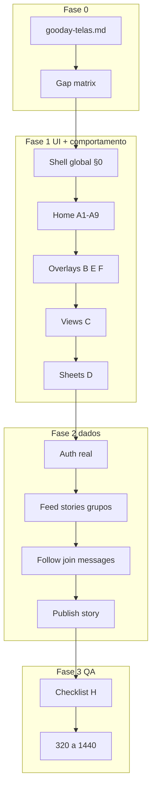

# Plano: validação completa de telas Gooday

## Fonte da verdade

O documento que você colou é a **spec consolidada** (prioridade sobre divergências pontuais). Já existem espelhos no repo:

- [src/imports/pasted_text/gooday-catalog.md](src/imports/pasted_text/gooday-catalog.md)
- [src/imports/pasted_text/gooday-behavior-spec.md](src/imports/pasted_text/gooday-behavior-spec.md)
- [src/imports/pasted_text/gooday-screens-behavior.md](src/imports/pasted_text/gooday-screens-behavior.md)

**Ação inicial:** salvar o texto consolidado como `src/imports/pasted_text/gooday-telas.md` (cópia canônica desta sessão) e usar esse arquivo + o checklist deste plano em toda validação.

**Abordagem de entrega (padrão escolhido):** duas fases — (1) fidelidade UI + comportamento, (2) wiring Supabase / persistência real. Telas podem “passar” na Fase 1 com mock se anatomia/ações/estados baterem com a spec; a entrega só fecha quando a Fase 2 estiver ok nas telas críticas.

---

## Diagnóstico atual (baseline)

Navegação hoje: **estado flat** em [src/App.tsx](src/App.tsx) (`useState` + `prevScreen`), **sem stack `go/back`**, sem body lock unificado, sem Toast / AvatarMenu / MediaCapture / várias sheets.

| Área | Status |
|------|--------|
| Shell Home 800px + headers + stories + feed + nav + rail | Parcial — base boa |
| Story Viewer | Parcial — lightbox simples |
| Create picker / post / story | Parcial — UI; sem MediaCapture nem publish |
| Buscar / Mensagens / Chat / Notificações | Existem — dados mock |
| Perfil / Meu perfil / Grupo / Grupos / Settings | Parcial — Supabase parcial |
| Publicação detalhe, Membros, Seguidores, Editar perfil view, Alterar e-mail/senha | Ausentes |
| Sheets: Comentários, Reagir, Share, Menu, Conta, Logout | Ausentes |
| Toast, AvatarMenu, MediaCapture | Ausentes |

Arquivos-chave: [App.tsx](src/App.tsx), [Home.tsx](src/screens/Home.tsx), [home.tsx](src/components/home.tsx), [api.ts](src/lib/api.ts), [media.ts](src/lib/media.ts).

---

## Fase 0 — Setup de validação

1. Commitar `gooday-telas.md` no repo.
2. Criar checklist operacional em `src/imports/pasted_text/gooday-delivery-checklist.md` (espelho da seção H + inventário de telas, com status `todo | doing | done | blocked`).
3. Definir matriz de teste por viewport: **390 / 768 / 1024 / 1440** (mínimo) + smoke 320 e 1800.
4. Fixar regra: cada tela só marca `done` na Fase 1 se anatomia + ações + estados + regras §0 daquela superfície passarem.

---

## Fase 1 — Fundação de comportamento (§0)

Antes de “fechar” telas individuais, alinhar o shell. Sem isso, a validação fica falsa.

**Em [App.tsx](src/App.tsx) + shell:**

- Stack real: `go(view, param?)` / `back()` / tab Início limpa stack
- Sheets como camada `z-70` (não “screen” que substitui Home no Criar)
- Body lock + restaura `scrollY` para view / sheet / story / media
- Escape na prioridade: emoji comment → emoji story → story → sheet → `back()`
- Z-index: 40 → 45 → 60 → 70 → 75 → 80 → 90
- Safe-areas em header, bottom nav, sheets, toast, views
- Toast global (`z-90`, 2600ms, posições mobile/desktop)
- `prefers-reduced-motion`

**Home shell ([Home.tsx](src/screens/Home.tsx) + [home.tsx](src/components/home.tsx)):**

- Full-bleed; grid desktop `max-content | minmax(280px,560px) | minmax(240px,1fr)`
- Feed = scroll da **página**; rail = scroll interno + fades 40px + wheel capture
- Stories: drag-to-scroll desktop (threshold 8px), snap, sem setas
- Chips: fades horizontais 24px

**Critério de saída Fase 1-fundação:** checklist §0 (layout, z-index, body lock, Escape, fades, drag) marcado.

---

## Fase 2 — Validar / completar Home (A1–A9)

Ordem de validação (e correção se falhar):

1. **A1 Home** — padding bottom vs nav; comunidades só `<800`
2. **A2/A3 Headers** — + → Criar sheet; sino → Notificações; avatar mobile → sheet Conta; desktop busca → view Buscar; avatar → AvatarMenu
3. **A4 Stories** — rings visto/não visto; `+` → MediaCapture story; tap abre Viewer
4. **A5 Communities** — tap → Grupo; share → sheet
5. **A6 Feed Post** — todas as ações → sheets/views corretas; double-tap like forçado; like pop 240ms
6. **A7/A8 Nav** — Criar abre picker (não tab de página); Início limpa stack; labels alinhadas à spec (Mensagens no slot atual)
7. **A9 Right Rail** — tabs, busca, filtros, Ver tudo → `groups` / `follows`, empty states

---

## Fase 3 — Overlays especiais (B, E, F + AvatarMenu)

| Item | Trabalho |
|------|----------|
| **B1 Story Viewer** | z-80, 5s/tick 60ms, tap 30/70, pause no reply/emoji, float reactions, fechar no fim |
| **E1 Media Capture** | steps source → camera\|gallery → review → busy; wire Create post/story |
| **F Toast** | componente global + disparos |
| **AvatarMenu** | z-75 desktop; mesmas ações da sheet Conta |

---

## Fase 4 — Views (C1–C14)

Validar cada view com o template da spec (anatomia → ações → estados → back stack).

**Prioridade de implementação (ausentes / parciais críticos):**

1. Stack + header Voltar padrão (todas as views)
2. **C4 Publicação** (detalhe) — hoje ausente
3. **C9 Membros** / **C10 Seguidores** — CTAs mortos hoje
4. **C8 Editar perfil** como view dedicada (hoje parcial inline)
5. **C13/C14** Alterar e-mail / senha
6. Alinhar **C7 Meu perfil** tabs: Publicações · Salvos · Grupos · Sobre
7. Polish **C1 Buscar**, **C5/C6 Mensagens/Chat**, **C2/C3/C11/C12** conforme anatomia

---

## Fase 5 — Sheets (D1–D10)

Unificar criação via sheet layer (não `screen === 'create'`):

1. D1 Criar picker → D2 Nova publicação / MediaCapture → D3 Story
2. D4 Comentários (mobile lista + desktop split ~44/56, max ~980px)
3. D5 Reagir · D6 Share · D7 Opções
4. D8 Notificações (já existe — alinhar)
5. D9 Sua conta · D10 Logout confirm

Ignorar D11 busca-sheet legado.

---

## Fase 6 — Dados reais (produto)

Só depois da UI estável:

| Fluxo | Fonte |
|-------|--------|
| Auth + logout real | já parcial — sheet logout + session |
| Feed / stories / grupos | RPCs existentes em [api.ts](src/lib/api.ts) |
| Publish post / story | insert + storage + refresh feed |
| Like / comment / react / save | tables + optimistic UI |
| Follow / join | persistir (hoje otimista) |
| Search | query pessoas/grupos |
| Messages / Chat | realtime ou polling (mínimo: CRUD) |
| Settings e-mail/senha | Supabase Auth updateUser |
| Notificações | tabela ou mock documentado até existir backend |

---

## Fase 7 — QA final e definição de pronto

Rodar inventário H do documento em cada viewport mínimo.

**Pronto para entregar** quando:

- Todas as telas do inventário H existem com anatomia/ações/estados corretos
- §0 (full-bleed, z-index, body lock, Escape, fades, timings críticos) ok
- Fluxos Create + Story + Comentários + Nav + Conta fechados
- Sem `.env` no git; secrets só em env
- Auth admin demo funcional
- Checklist delivery 100% `done` ou `blocked` com motivo aceito

---

## Checklist de entrega (to-do mestre)

Usar como board. IDs estáveis para tracking.

### Fundação
- T0 Salvar `gooday-telas.md` + `gooday-delivery-checklist.md`
- T1 Stack go/back + sheets layer + body lock + Escape
- T2 Toast global + z-index shell
- T3 Fades rail/chips + drag stories + safe-areas

### Home
- T4 Headers mobile/desktop ações corretas
- T5 Stories + Viewer spec
- T6 Communities carousel
- T7 Feed Post ações → sheets/views
- T8 Mobile/Desktop nav + Right Rail

### Overlays
- T9 MediaCapture completo
- T10 AvatarMenu desktop
- T11 Toast em todos os fluxos críticos

### Views
- T12 Buscar live
- T13 Perfil pessoa + follow
- T14 Grupo + join + Ver membros
- T15 Publicação detalhe
- T16 Mensagens + Chat
- T17 Meu perfil tabs + Editar perfil
- T18 Seguidores + Membros
- T19 Meus grupos
- T20 Settings + e-mail + senha

### Sheets
- T21 Criar / Post / Story
- T22 Comentários / Reagir / Share / Menu
- T23 Notificações / Conta / Logout

### Dados + QA
- T24 Persist publish/like/comment/follow/join
- T25 Search + messages backend mínimo
- T26 QA breakpoints + reduced-motion + regressão inventário H
- T27 Commit/push final na conta `lucasmarteux@gmail.com`

---

## Método de validação por tela

Para cada item do inventário, preencher:

1. Abrir (rota/gesto)
2. Anatomia (checklist visual)
3. Cada ação da tabela da spec
4. Estados (empty/loading/error/active)
5. Regras §0 aplicáveis
6. Mobile + Desktop
7. Resultado: pass / fail + nota + arquivo

Falhas viram fix imediato na mesma fase antes de avançar (não acumular “pass parcial” sem ticket).
